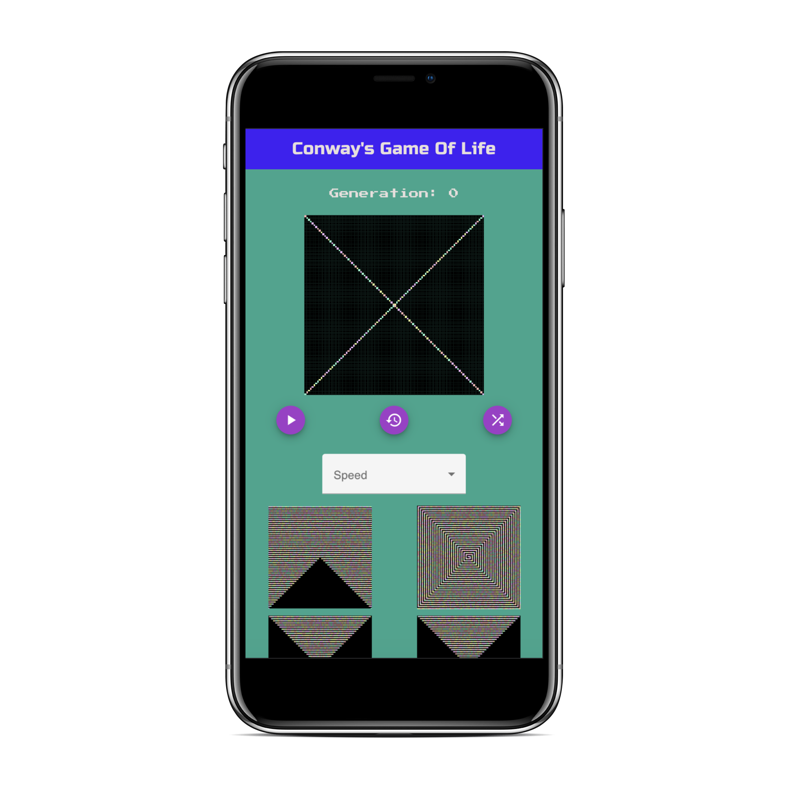
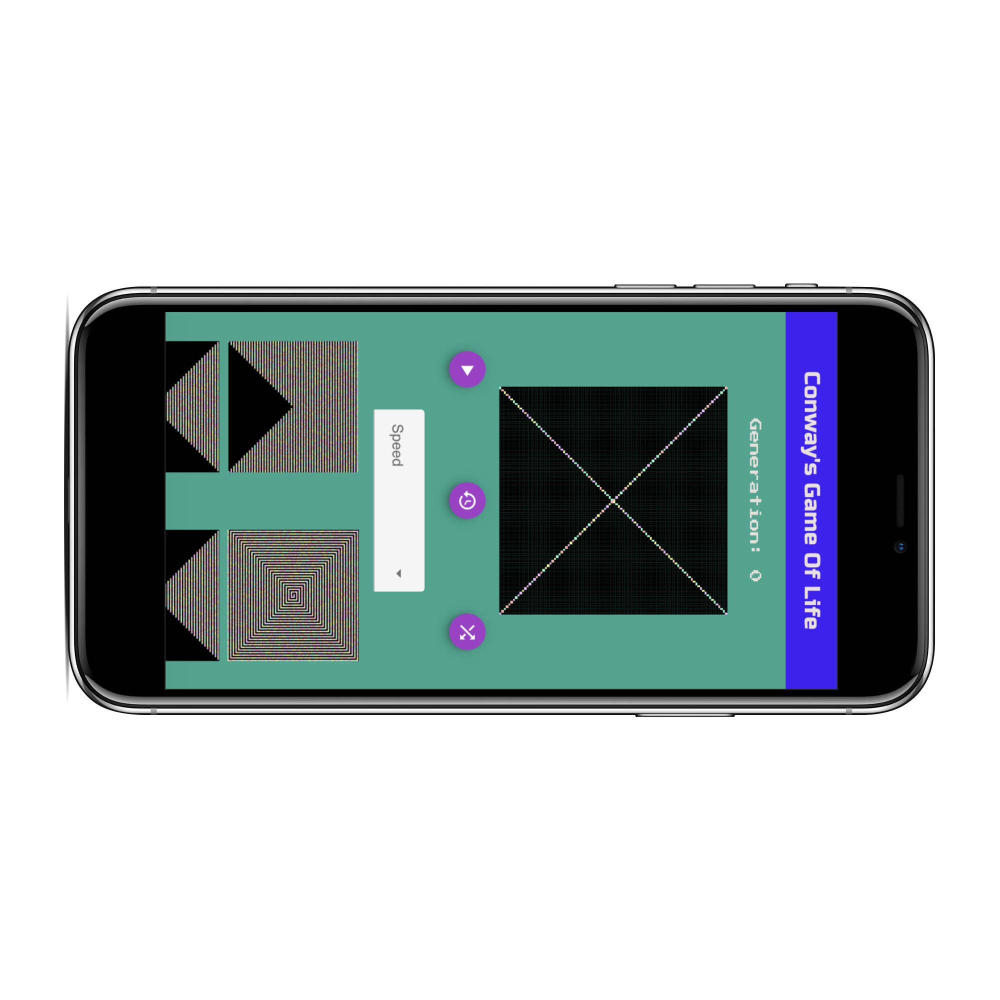

# Conways Game Of Life 
     

My recreation of the popular zero player game, Conway's Game Of Life. Built with 😂 😭 😊, `reactjs`, `immer`, `redux` and `rmwc` being my styling library of choice

## Table of Contents
- [General Information](https://github.com/agyin3/conways-game-of-life#general-information)
- [Screenshots](https://github.com/agyin3/conways-game-of-life#screenshots)
- [Technologies](https://github.com/agyin3/conways-game-of-life#technologies)
- [Installation](https://github.com/agyin3/conways-game-of-life#installation)
- [Features](https://github.com/agyin3/conways-game-of-life#features)
- [Resources](https://github.com/agyin3/conways-game-of-life#resources)
- [Contact](https://github.com/agyin3/conways-game-of-life#contact)

### General Information

Created in 1970 by John Conway, *Game Of Life* is a zero-player computer classic that simulates cellular automaton. As a user you provide the game with a grid of cells, each that are either alive or dead, and the game will then utilize an algorithim to continuously simulate the next generation/state of the grid.

#### Rules of the Game

- If the cell is alive:
    - Remains alive with 2 or 3 neighbors
    - Dies in every other case

- If the cell is dead
    - Comes to life with exactly 3 neighbors
    - Remains dead in every other case

#### Algorithm

As this specific game isn't new, my main objective for the project was being able to both find and implement an algorithm that could simulate cellular automata. In creating the grid, I decided to utilize a 2d array with `1` indicating a cell is alive and `0` indicating a cell is dead. 

With this in mind I first had to determine the relationship between the given cell, `grid[x][y]` and its 8 neighbors, which can be described as such:

| Name          | Position        |
| ------------- | --------------- |
| top-left      | grid[x-1][y-1]  |
| top-center    | grid[x-1][y]    |
| top-right     | grid[x-1][y+1]  |
| left          | grid[x][y-1]    |
| right         | grid[x][y+1]    |
| bottom-left   | grid[x+1][y-1]  |
| bottom-center | grid[x+1][y]    |
| bottom-right  | grid[x+1][y+1]  |

From there the algorithm could calculate a total number, `sum`, from the values of its neighbors. Based on the rules of the game, if the cell was alive, `grid[x][y] === 1`, and `sum === 2 || sum === 3` then the cell would stay alive, keeping it's value at `1`. Also, if the cell was dead, `grid[x][y] === 0`, and `sum === 3` then the cell would come alive updating it's value from `0` to `1`. All other cases would result in `grid[x][y] = 0`. 

Given that the grid was represented by a 2d array, the algorithm utilized a nested for loop in order to access each cell within the grid to achieve it's goal of simulating cellular automata. 

```js
for(let x=0; x<numOfRows; x++){
    for(let y=0; y<numOfCols; y++){
        // rest of algorithm
    }
}
```

For my version of the *Game Of Life* I made the decision of considering any cell off the grid to be dead and therefore represented by a `0`.

### Screenshots


 


### Technologies

- Parcel Bundler
- Babel
- React
- Immer
- Redux
- rmwc
- Material Design


### Installation

Download the repo onto your local machine [here](https://github.com/agyin3/conways-game-of-life.git)<br>
Run `npm i` to install all of the necessary dependencies<br>
Run `npm run start` to start the local server<br>

### Features

#### Implemented

**Cellular Automaton (CA)**

Cellular Automaton (CA) is a discrete set of computational systems. CA can simulate the behavior of a set of cells over time based on a simple set of rules. The awesome thing about CA is often times very complex behavior will emerge from a simple set of rules.

**Turing Completeness**

Turing Completeness is the ability of a computing system to take in an arbirtary amount of data and make decisions based on a set of rules. In Conway's Game Of Life, this phenomenom is simulated by the user providing a grid of any size while the game infinitely simulates the next generation of life based on a simple set of rules.

**Double Buffer**

This project utilizes immer and redux to implement a double buffer. Simply put, the web application will display the current generation to the user while runnnig the algorithm in the background to produce the next state/generation. Once this process is complete, the next generation will then become the current state and the process will repeat.

**Customizable**

Users have the option of creating their own designs by clicking on individual cells to toggle it being alive/dead, easily generating a random game board with the push of a button, selecting from different preset game designs, and even selecting the speed at which each new generation is produced. 

#### Future Features

1. By utilizing a nested for loop the algorithm has an O(n^2) runtime which isn't ideal and will quickly slow down the runtime of the program as the size of the grid grows. Would like to explore utilizing different data structures and memoization to optimize the runtime

2. Adding feature to allow a user to manually step through the generations 

3. Adding feature to allow a user to adjust the size of the grid


### Resources

- [Conway's Game Of Life](https://en.wikipedia.org/wiki/Conway%27s_Game_of_Life)
- [Cellular Automaton](https://en.wikipedia.org/wiki/Cellular_automaton)
- [Turing Completeness](https://en.wikipedia.org/wiki/Turing_completeness)
- [rmwc styling library](https://rmwc.io/)

### Contact

Created by [Buddy Agyin](https://buddyagyin.com) - feel free to contact 

